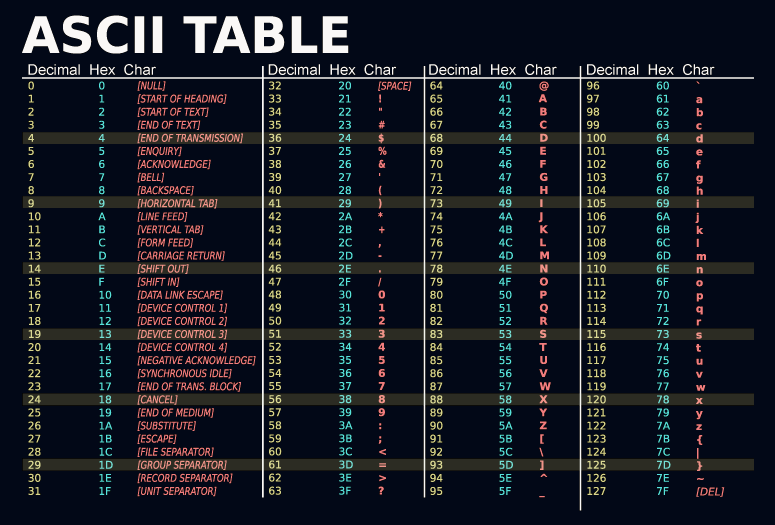

# What is AsciiDraw?

AsciiDraw is a client-side only web-based application for drawing ASCII graphs and diagrams.

The main purpose is to create graphics consisting of ASCII-Letters to display them correctly in restricted environments, e.g. your cmd Terminal.

AsciiDraw is configured to use only characters from the basic [ASCII set](https://en.wikipedia.org/wiki/ASCII).
This ensures the best compatibility with other application that are later used to display your graphs.

Since the characters from the normal ASCII set are limited, you may not can build your desired graphic. Therefore, we are also supporting [Extended ASCII](https://en.wikipedia.org/wiki/Extended_ASCII) characters or even [Unicode](https://en.wikipedia.org/wiki/Unicode) in our editor.

In order to use these characters you just have to change the style on your element.
